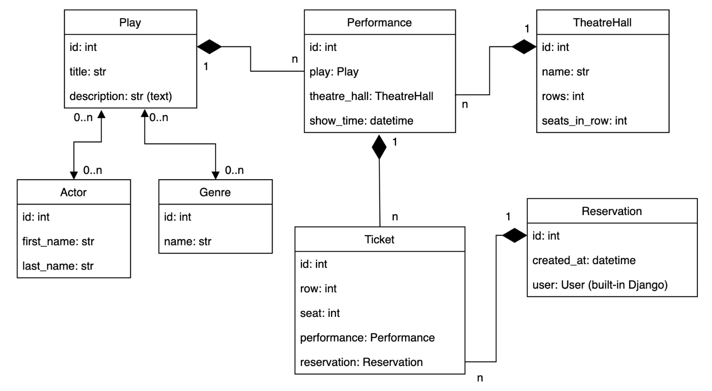
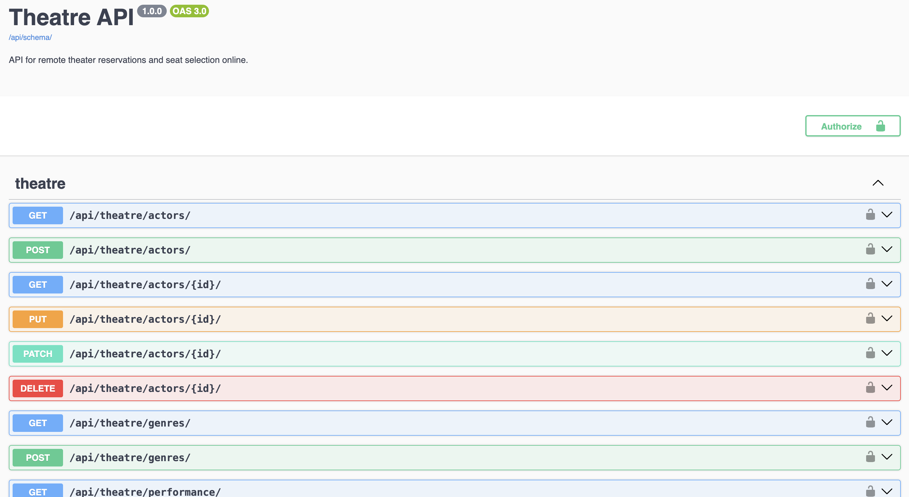
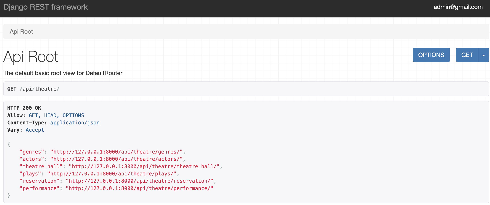

# Theatre-API-Service

#### This API serves as an online platform for visitors of the local theatre to make reservations and select seats without physically visiting the theatre.

#### DB Structure


## Features
- **CRUD Operations**: Perform Create, Read, Update, and Delete operations.
- **JWT Authentication**: Secure endpoints with JSON Web Token authentication.
- **Granular Permissions**: Fine-grained permissions ensure controlled access.
- **Play and Performance Filtering**: Streamline searches based on plays and performances.
- **Comprehensive Documentation**: Extensive documentation available for developers.
- **Admin Panel**: Intuitive administration interface for managing the API.
- **Pagination**: Divides data, simplifies navigation, enhances accessibility


### Installation & Run in Docker

Clone the repository:
```
git clone https://github.com/DenPrislipskyi/Theatre-API-Service.git
```
Ensure that the Python environment is set up:

For macOS:
```
python3 -m venv venv
```
```
source venv/bin/activate
```

For windows:
```
python -m venv venv
```
```
source venv/scripts/activate
```

Create a `.env` file and add the following configurations:
```
POSTGRES_HOST=db
POSTGRES_DB=db
POSTGRES_USER=postgresuser
POSTGRES_PASSWORD=postgrespassword
```
Once everything is set up, proceed to run the application using Docker Compose:
```
docker-compose up --build
```

### Create a Default User access the following URL:
http://127.0.0.1:8000/api/user/register/

Ordinary users are restricted to creating reservations only and have read-only access to all other API endpoints.


### Create Superuser
Execute the following commands:
```
docker exec -t your_container_id bash
```
```
python manage.py createsuperuser
```
### Go to site: http://127.0.0.1:8000/api/theatre/

### [**Documentation**](http://127.0.0.1:8000/api/doc/swagger/)


### [**API**](http://127.0.0.1:8000/api/theatre/)

